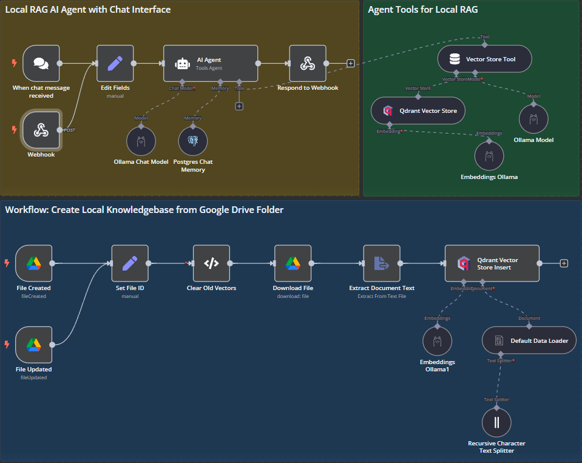

#### Project Status
Currently merely experimenting with webhook connection from n8n...
Current progress:
- The RAG AI is successfully built but its docker container setup on a different git.
- Failed in connecting the RAG AI to our current setup... will try again
#### current architecture 

#### next steps after this includes
- [ ] setup docker yml, frontend, and websocket on the same git.
- [ ] determine the correct requirements.txt to perform this.